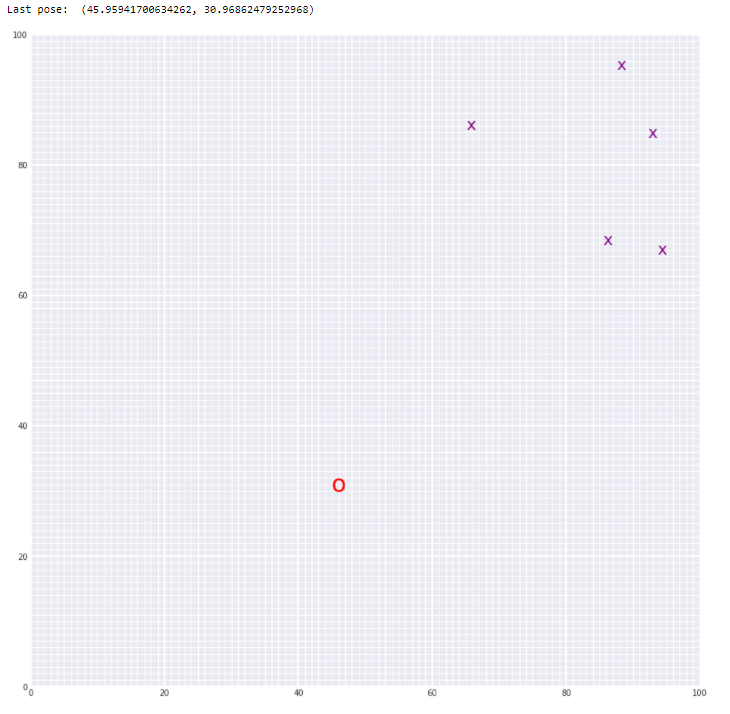

# Landmark Detection and tracking using SLAM
**Tools and Technology used:** Python, Pandas, matplotlib

Implemented SLAM (Simultaneous Localization and Mapping) for a 2 dimensional world for a robot, to detect and keep track of landmarks through the combination of motion and sensor data that was gathered over time. The 2D world is created for the robot with random initialization of the landmarks on the map.

## Result

Below you can see an example of a 50 x 50 grid world with with landmarks (purple x's) and robot position (a red 'o') lcreated by using only sensor and motion data collected from the robot.

